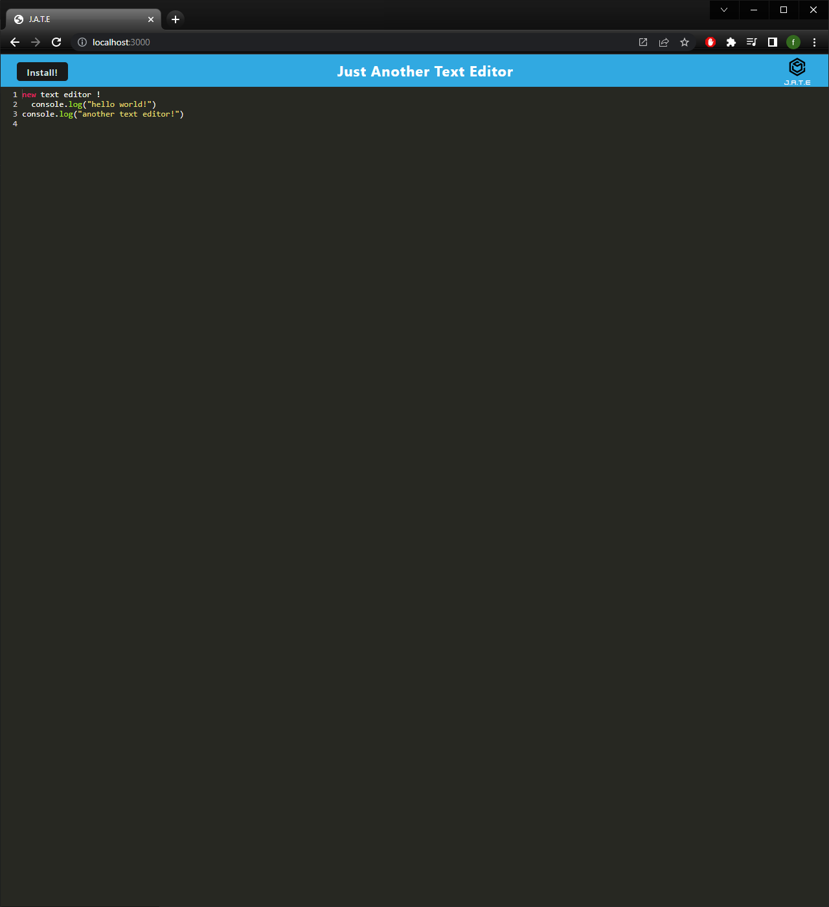

# JATE Text Editor

  # 

  ## Table of Contents
  - [Description](#description)
  - [Installation](#install)
  - [Usage](#usage)
  - [License](#license)
  - [Questions](#questions)
  

  ## Description

  This Text-Editor app is a single page application that meets PWA criteria. This text editor can also be installed for
  offline use.

  ## Installation

  - npm start 
  - npm run build 

  - [REPO](https://github.com/fernandot10/TextEditor-PWA)
  - [HEROKU](https://jate-text-editor-ft.herokuapp.com/)

  ## Usage

  - JATE web 
  

  - IndexDB
  

  - Manifest
  

  - Service Worker
  
  

  ## License 
  MIT
  
  ## Questions
  How to reach me...
  - GitHub: https://github.com/fernandot10
  - Email: fernando.t10@outlook.com

  